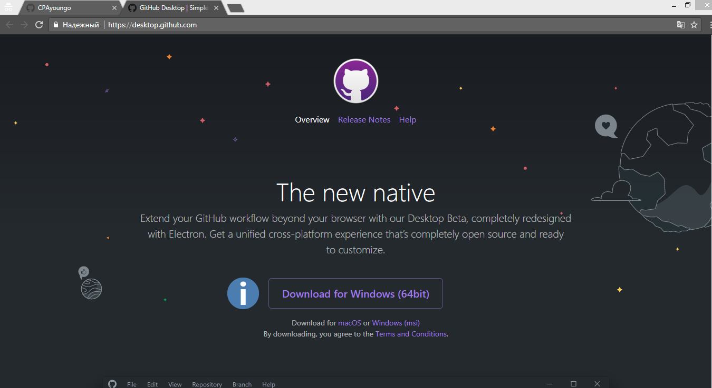
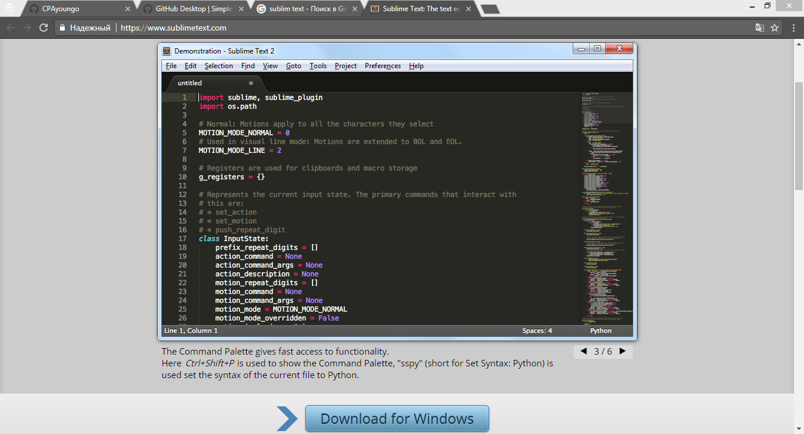
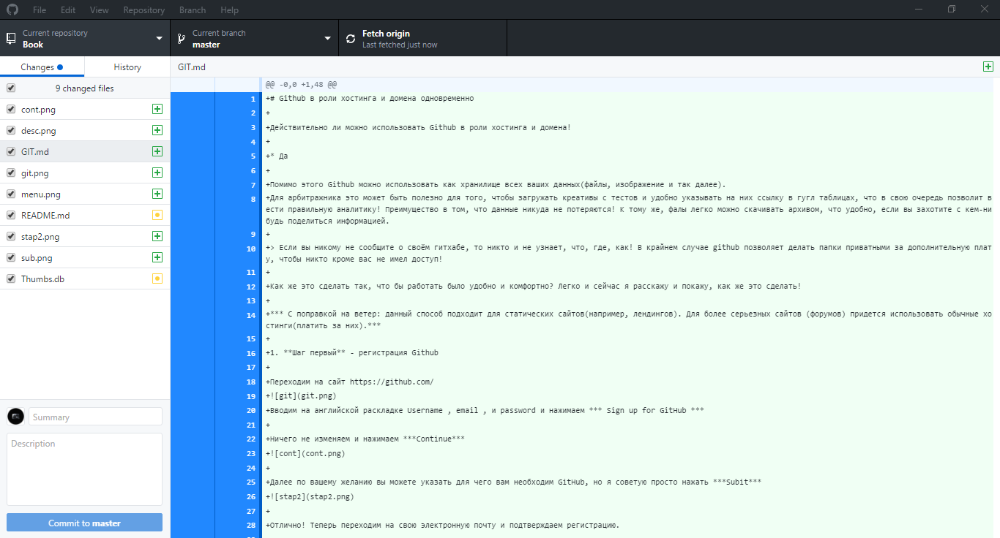
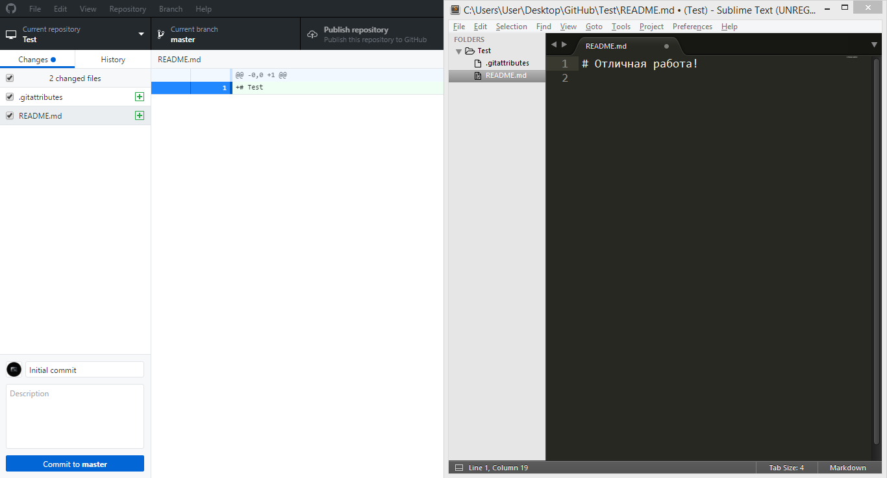
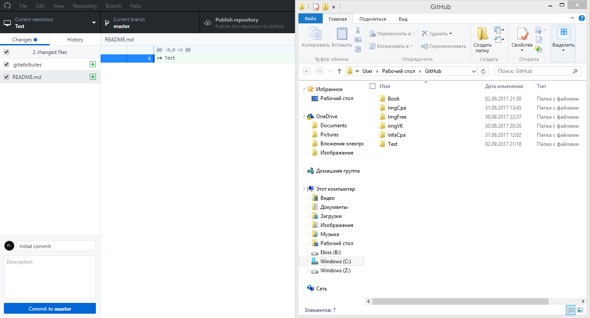

# Github в роли хостинга и домена одновременно

>Важные моменты, поскольку в процессе будет устанавливаться IDE, через которую будут редактироваться html коды (лендинги и много другое).

Действительно ли можно использовать Github в роли хостинга и домена + можно привязать свой домен!

* Да

Помимо этого Github можно использовать как хранилище всех ваших данных(файлы, изображение и так далее).
Для арбитражника это может быть полезно для того, чтобы загружать креативы с тестов и удобно указывать на них ссылку в гугл таблицах, что в свою очередь позволит вести правильную аналитику! Преимущество в том, что данные никуда не потеряются! К тому же, фалы легко можно скачивать архивом, что удобно, если вы захотите с кем-нибудь поделиться информацией.

> Если вы никому не сообщите о своём гитхабе, то никто и не узнает, что, где, как! В крайнем случае github позволяет делать папки приватными за дополнительную плату, чтобы никто кроме вас не имел доступ!

Как же это сделать так, что бы работать было удобно и комфортно? Легко и сейчас я расскажу и покажу, как же это сделать!  

*** С поправкой на ветер: данный способ подходит для статических сайтов(например, лендингов). Для более серьезных сайтов (форумов) придется использовать обычные хостинги(платить за них).***

1. **Шаг первый** - регистрация Github

Переходим на сайт https://github.com/

Вводим на английской раскладке Username , email , и password и нажимаем *** Sign up for GitHub ***

Ничего не изменяем и нажимаем ***Continue***
   

Далее по вашему желанию вы можете указать для чего вам необходим GitHub, но я советую просто нажать ***Subit***


Отлично! Теперь переходим на свою электронную почту и подтверждаем регистрацию.

Возвращаемся обратно и в правом верхнем углу нажимаем на галочку, затем - ***Your profile***. 

2. **Шаг второй** - устанавливаем Github на компьютер

Переходим на сайт https://desktop.github.com/ и нажимаем ***Download ... *** 


Открываем файл, который скачали! Следуем инструкциям, которые предлагает GitHub. Там, где потребуется ввести Username и email, вводим данные, которые использовали при регестрации на GitHub.

Теперь всё готово к работе! Легко, не правда ли? А еще легче работать и подгружать данные с компьютера на сам GitHub.

3. **Шаг третий** - устанавливаем IDE. Зачем? поймете позднее!

Скачиваем Sublim Text. 
Переходим на сайт https://www.sublimetext.com/ и скачиваем! После этого устанавливаем. Установка простая, поэтому показывать нет смысла.


4. **Шаг четвертый** - интеграция Sublim Text и GitHub Desktop

Открываем программу GitHub Desktop, которую установили. Приблизительно так она выглядит!


Итак, для начала создадим репозиторий - пака на вашем компьютере и в дальнейшем репозиторий на GutHub.

В этой программе нажимаем ***File*** затем ***New repository***. Либо нажимаем ctrl+N. Как вам будет удобнее.
Вводим Name, ставив галочку, как показано на скриншоте и нажимем ***Create repository***.
Ах, да, чуть было не забыл. Изменяем Local path на любую другую папку, в которую будут сохраняться репозитории, либо оставляем все так, как оно есть.

Нажимаем, куда указывает красная стрелка на скриншоте:


Теперь нажимаем правой кнопкой мыши на Файл README.md  и выбираем ***Open whith default program***. Соответственно для сторонней программы выбираем Sublim Text, который установили до этого! Интеграция завершена.

Теперь, чтобы открывать какие - либо репозитории в Sublom text вам нужно нажать ctrl+shift+A.


Работать в IDE также, как и в блокноте, только куда удобнее и проще! Функционал Sublim text постарайтесь изучить самостоятельно.

Также, для того, чтобы открыть папу репозитория легко и быстро достаточно нажать ctrl+shift+F.


Давайте теперь вновь откроем Sublim Text(ctrl+shift+A). Нажмем на файл README.md и что-нибудь напишем. После этого, чтобы сохранить нажмем ctrl+S. Тем самым, изменённая информация сохранится! Перейдём обратно в программу GitHub Desktop и в левом нижнем углу напишем комментарий к изменению, нажав после этого ***Commit to master***, либо ctrl+Enter. Затем ctrl+P, чтобы опубликовать изменения на GitHub. Убираем галочку ***Keep this code private***


Переходим в браузер в свой профиль GitHub и видим, что у нас появился репозиторий, который мы создали!

Теперь вы сможете быстро подгружать всю необходимую информацию на сервис. Постоянно этого делать не нужно. По крайней мере, теперь ваши файлы будут храниться в одной большой папке и не будут разбросаны где попало + железно храниться на GitHub, доступ к которому вы можете получить с любого компьютера, имеющего интернет. С GitHub данные репозитория скачиваются архивом нажатием одной кнопки ***Clone or download***

5. **Шаг пятый** - GitHub в роли хостинга и домена

Для этого нам нужно создать новый репозиторий! Переходим в программу GitHub DesKtop и нажимаем ctrl + N.
Вводим Name: Username.github.io, ставив галочку для фала README.md и нажимаем ***Create repository***.
Открываем Sublim Text (ctrl+shift+A), редактируем файл README.md. Для этого нажимаем на файл и прописываем.

>	# Username.github.io
>
>	http://Username.github.io - ссылка, по которой доступна страница 

Сохраняем(ctrl+S).

Нажимаем тут же в Sublim Text (ctrl+N).
Пишем, например, так:

```html
	<!DOCTYPE html>
	<html>
	<head>
		<title></title>
	</head>
	<body>
	<p>Отличная работа, Друг!</p>
	</body>
	</html>
```

И сохраняем(ctrl+S) c именем index.html в репозиторий(папку) Username.github.io

Переходим обратно в программу GitHub Desktop, прописывем комметраний к изменениям, нажимаем crtl+Enter и потом ctrl+P. Теперь наши изменения опубликованы на GitHub.

Осталось только перейти по ссылке http://Username.github.io , чтобы посмотреть результат!


Иногда немного нужно подождать, чтобы сервер обновил информацию! (1-3 минуты)

Таким образом вы можете держать не один и не два сайта! Это тоже сдеать довольно-таки просто.

6. **Шаг шестой** - несколько сайтов.

Если вы хотите несколько сайтов, то вам просто нужно создать в репозитории Username.github.io папки для этих сайтов. Для этого просто переходите на компьютере в папку Username.github.io и создаете сколько хотите. Важно только то, что в кажжом из них должен быть файл index.html и README.md.

К примеру, если мы создадим в папке Username.github.io папку blog, то в ней обязательно должны присутствовать index.html и README.md. Причём, теперь уже файл README.md будет иметь такое вот содержание

>	# Username.github.io/blog
>
>	http://Username.github.io/blog - ссылка, по которой доступна страница 

После всех изменений делаем публикацию на GitHub аналогично тому, как уже делали! 

7. **Шаг седьмой** - можно Схитрить.

О чём я? К примеру, у нас есть сторонний сайт http://google.com/ а мы хотим где-либо использовать http://Username.github.io. 

Тогда просто достаточно сделать редирект!

Делается это следующим образом! 

Мы в папке Username.github.io в файле index.html прописываем следующий код

```html
<!DOCTYPE html>
<html>
<head>
	<title></title>
</head>
<body>

<script language="JavaScript"> 
  window.location.href = "http://google.com/"
</script>

</body>
</html>
```

То есть, мы с вами между тегами ***body*** вставили скрипт, который выполняет редирект(перенаправление) без соглашения на то пользователя!

Вот именно этот скрипт! Ссылку можно поменять.
```html
<script language="JavaScript"> 
  window.location.href = "http://google.com/"
</script>
```
8. **Шаг восьмой** - своё доменное имя и хостинг GitHub.

Гитхаб позволяет использовать собственное доменное имя вместо стандартного username.github.io. Для этого, разумеется, вам сначала нужно приобрести его.

На сайте GutHub перейдём в репозиторий Username.github.io.
Нажмём ***Settings***.
Двигаемся вниз до **GitHub Pages**.
***Custom domain** - прописываем доменное имя и нажимаем ***Save***

Теперь Гитхаб знает о нашем домене, однако, этого недостаточно — нужно изменить информацию о DNS-записях самого домена, для этого нам необходимо перейти на сайт доменного регистратора, где домен был куплен. Интерфейс работы с DNS-записями разный у каждого регистратора, но суть примерно одинакова.

Нам нужно настроить A-запись домена, для этого перейдём в панель управления DNS-записями, найдём (или добавим) A-запись и укажем «192.30.252.153» в качестве её значения.

Всё готово! В течение нескольких часов вы сможете открыть свой сайт, используя ваш домен.

> [Памятка](https://help.github.com/articles/setting-up-an-apex-domain/#configuring-a-records-with-your-dns-provider) GitHub по настройке А-записей у DNS провайдера.

8. **Шаг девятый** - правила оформления файла README.md на GITHUB
```html
# Заголовок

### h3 заголовок третьего уровня
#### h4 заголовок четвёртого уровня
##### h5 заголовок пятого уровня
###### h6 заголовок шестого уровня

[Мой сайт](http://webdesign.ru.net) - оформление ссылки словом 

**Жирный шрифт**
***Наклонный жирный***

`выделенные слова`

Вставка html кода.  Теги выделяются цветом по правилам html.
```html
<meta name="viewport" content="width=device-width, initial-scale=1.0">
``` 
Вставка php кода.  Теги выделяются цветом по правилам php.
```php
<?php here_pagecontent(); ?>
```
Выделенный цветом фона блок с каскадными таблицами. Теги выделяются цветом по правилам css.
```scss /* или css */
@import "bower_components/tree-normalize/generic.normalize";
h1 {
 font-size:1.5em;
 font-weight: 300;
}
```
Блок текста, выделенный тёмной полосой по левому краю (цитата).
> Текст
> 
> Продолжение текста выделенного блока
> Завершение текста

Нумерованный список.
* Пункт 1
* Пункт 2
* Пункт 3

1. Пункт 1
2. Пункт 2
3. Пункт 3

Вставка изображения в текст.


Так можно рисовать таблицы

Название файла  | Содержание файла
----------------|----------------------
style.css       | Пустой файл каскадной таблицы стилей, в который производится сбока необходимых стилей
reset.css       | Reset CSS от Эрика Мейера
normalize.css   | Нормалайзер CSS от Nicolas Gallagher
block.css       | Основные стили блоков системы
addition.css    | Дополнительные стили
fontawesome.css | Стили иконочного шрифта
layout.css      | Основные стили, применительно к определённому сайту
lightbox.css    | Стили лайтбокса, если таковой используется
index.html      | Индексный файл для проверки вносимых изменений

```
Всё это будет выглядеть красиво в файле README.md и в любом другом файле (.md), который вы опубликуете в GitHub.
