# Бизнес в интеренете | Арбитраж трафика | Cpa | Facebook

***Перейдем сразу к делу, чтобы не повторять ошибок многих инфобизнесменов.***

# 1. Глава | Теория

* Арбитраж трафика - это покупка и последующая перепродажа, ранее купленного интернет трафика на более выгодных условиях. То есть, по сути, мы грамотно настраиваем рекламные кампании и извлекаем из этого прибыль.

* Адверт - это синоним слова арбитражник /вебмастер (это человек, который сливает трафик на CPA сети и партнерские программы, по сути это мы с Вами – те, кто занимается покупкой интернет трафика).
* Трафик - чтобы не говорить заумных слов, скажем по-простому: трафик - это люди в интернете, которые то и дело что-то ищут, лазят по сайтам, сидят целыми днями в Вк, слушают музыку и смотрят видео, и что самое интересное - имеют свои потребности и готовы платить деньги за товар или услугу, которая их интересует.
* Тизерка (тизерная сеть) – место, в котором мы покупаем трафик, таких сервисов куча, писать подробно о них я тут не буду.
Тизер (от английского дразнилка, не путать с тизеркой!) - это картинка + текст, как правило, 200х200. Говоря по-простому, это сочетание текста и картинки, с помощью которого мы добываем трафик.

* Оффер - переводится с английского как предложение, то есть, по сути, это рекламное предложение (предложение от рекламодателя). Вы выбираете понравившийся вам оффер из специальных каталогов, на что вам сливать трафик

* ЦА - целевая аудитория, вы должны понимать, что арбитраж трафика приносит деньги только тогда, когда вы взаимодействуете с целевой аудиторией, когда ваши тизеры показываются тем людям, которых они реально могут заинтересовать.    
Таргетинг - синоним слова ЦА, по сути таргетинг - это ваш прицел рекламы на ЦА, обычно он выставляется с помощью таких параметров, как пол/возраст/страна/город интересы и т.д. Казалось бы, ничего сложного, но именно из-за неправильного таргетинга большинство начинающих арбитражников сливают свой бюджет в минус и потом горько плачут и говорят, мол, арбитраж не работает.

* CPA - с английского дословно переводится как плата за действие, по сути это каталог офферов, в них обращается рекламодатель и говорит: “У меня есть шуба, если вы приведете мне покупателя на эту шубу - я заплачу вам 1000 рублей”. Тут ничего сложного, если сейчас не поняли, со временем разберетесь.

* ПП - партнерская программа (почти одно и то же что и CPA), ну тут все понятно, это место в которое мы продаем добытый нами трафик.
Конверсия - синоним слова Лид, объясню на примере. Вы выбрали оффер, сделали тизера и начали лить трафик. Когда пользователь придет и купит рекламируемый вами товар или услугу, тогда можно будет сказать, что он сконвертился или стал лидом. То есть конверсия это, по сути, показатель того сколько людей купили ваш товар или услугу.

* CPC - вид покупки рекламы, в котором вы платите только за клики, к примеру, 2 рубля за 1 клик.

* CPM - вид покупки рекламы, в котором вы платите только за показы, к примеру, 2 рубля за 1000 показов.

* CTR - соотношение показов и кликов нашего тизера, он показывает насколько наше объявление интересно целевой аудитории, максимальный CTR 100%, считается по формуле ->
CTR = (количество кликов / количество показов) * 100
Чем выше ваш CTR, тем круче вебмастером вы считаетесь.

* CR - показатель того какой процент людей покупают товар, который вы рекламируете (из 1000 кликов 5 покупок к примеру, считается в процентах). Этот показатель есть во всех CPA сетях. Но мы не рекомендуем принимать его близко к сердцу, всегда считайте этот показатель для себя, а не делайте выводы, исходя их среднего показателя в партнерке. 

* EPC - это показатель заработка за 1 клик, сколько в среднем один пользователь, кликнувший на ваш тизер, приносит вам дохода. Выводится из показателя CR. Все, что я писал про CR, относится и к EPC.

* ROI - по сути это возврат ваших инвестиций, чтобы было понятней, приведу такой пример. Мы выбрали оффер, выбрали тизерную сеть для него, и сделали тизера. Теперь нам нужно слить бюджет на рекламу. К примеру, мы потратили 100 рублей, а заработали 200 рублей. В этом случае ROI=100%, потому что мы получили в 2 раза больше, чем потратили. Это средний показатель ROI, он может быть и 200 и 300 и 400.

* Адалт - это вид трафика, который связан с порно, всякие секс шопы, сайты с путанами, секс знакомств и т.д. (ну вы поняли :D) В целом не плохо конвертятся, если знать, как работать с этим видом трафика...
Лендинг - от английского landing page страница приземления. Делается для того, чтобы у пользователя не рассеивалось внимание, когда он придет за товаром или услугой. К примеру, есть какой-то большой интернет-магазин одежды, если вы будете лить на главную магазина, то вы плохой арбитражник. У пользователя разбегутся глаза, он увидит сразу сотню предложений: купить куртку, носки, шапку ушанку, варежки, трусы. И все по скидке и прямо сейчас. Если вы думаете, что он реально возьмет и купит - вы ошибаетесь, такое происходит крайне редко, скорее всего, он увидит ваше предложение и пойдет думать дальше. Чтобы этого не происходило, мы фокусируем внимание пользователя на одном предмете, например, на носках. Рассказываем какие они у нас красивые и качественные. Вот тогда шанс того, что пользователь превратится в покупателя (сконвертится/ станет лидом) возрастает в разы.

* Прокладка - это понятие сродни лендингу (это сайт или страница, которую делают для "подогрева" целевой аудитории). Бывает такое, что рекламодатель не понимает, что его лендинг полное г-но, но сам оффер, в целом, вам нравится. Вот тут и приходится изворачиваться, делать прокладку под лендинг, на который вы какой-то интересной историей подогреваете клиента, чтобы тот более охотно покупал товар или услугу, которую вы предлагаете. Вы 100% видели прокладки, такие, например, как Пугачева похудела и т.д.

* Блек-лист (БЛ) - черный список, если говорить по-русски, это, по сути, список сайтов (ID сайтов) на которых вы не хотите разместить ваши тизеры. Не буду подробно об этом рассказывать, это вообще отдельная тема, про которую более подробно вы узнаете в нашем курсе. В любом случае, если вы новичок, то это вам пока не нужно, потому что, как правило, для составления блек листов, требуется слить нормально бюджета.

* Вайт-лист (ВЛ) - белый список, тоже самое, что и с блек-листом, только наоборот. Это список сайтов, на которых вы хотите показывать свои тизеры. Делается это для того, чтобы улучшить качество добываемого трафика.

* Переходы — количество переходов по вашему объявлению, совершённых уникальными пользователями. Если этот пользователь ВКонтакте уже переходил по данному объявлению (с любого компьютера), ему оно больше показываться не будет. Обратите внимание, что в случае с рекламой видеозаписи под переходом понимается нажатие на объявление, а не переход на сайт рекламодателя по ссылке, находящейся справа под воспроизводимым роликом.

* Показы — появления объявлений на страницах ВКонтакте, загружаемых пользователями. То, насколько часто ваше объявление показывается пользователям, зависит от стоимости за переход и эффективности объявления, если Вы предпочли оплату за переходы. Если Вы предпочли оплату за показы, тогда от стоимости 1000 показов.

* Охват — количество уникальных пользователей, которым хотя бы раз было показано рекламное объявление.

* Связка - это оффер, который Вы продвигаете + источник трафика, с которого Вы сливаете. Многие вписывают в понятие связка дополнительно параметр ГЕО. То есть в этом случае будет учитываться регион, где будет идти реклама.
Например: Часы ROLEX + РСЯ + РФ.

* РСЯ - рекламная сеть яндекса. То есть, реклама откручивается на площадках-партнерах Яндекса. Площадках, на которых им продают трафик.

* КМС – контекстно-медийная сеть Google. В целом, аналог РСЯ. Со своими преимуществами и недостатками (об это уже позже).

* MT (MyTarget) - источник трафика от компании mail.ru, работающий по принципу таргетированной рекламы.

* Facebook Реклама - полная аналогия mail.ru, только в Фейсбуке. Со своими преимуществами и недостатками.

* Аппрув - аппрув бывает двух типов. Первый - это модерация вашей рекламы. Когда вы даете рекламное объявление и модератор его пропускает или нет. Именно факт пропуска рекламы мы называем аппрув.

* Второй вид аппрува - это аппрув лида. Когда вы привлекли в партнерскую программу лида, это еще не значит, что Вы заработали. Лида должны прозвонить / обработать / проверить. Только когда он прошел проверку - это означает, что его “зааппрувили” и вам начислили за него выплату на баланс. Такие лиды называют валидными.
Такие лиды называют валидными.

* Холд - это заморозка на время аппрува. Например,  вашему офферу нужно 5 дней, чтобы проверить стоит ли давать вам деньги за этих лидов или не стоит.

# 2. Глава | Домен | Хостинг

* Как зарегестрировать домен?

> 1. Перейдем на сайт http://2domains.ru
> 2. Регестрируемся. Нажимаем на кнопку ***[Регистрация]***
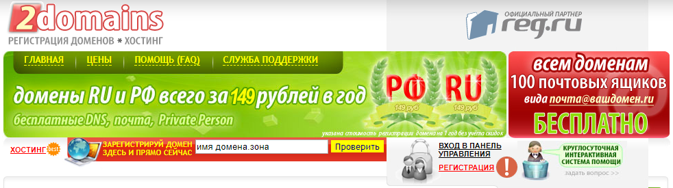
> 3. Нажимаем ***[Зарегестрироваться]***
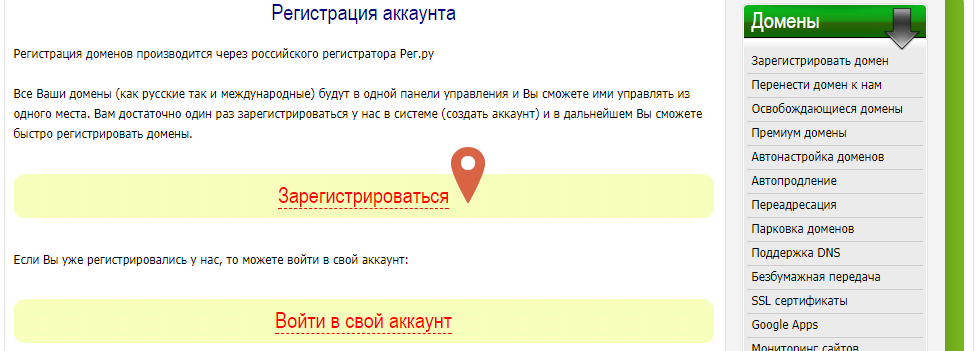
> 4. Заполняем коррекнто все необходимые данные и нажимаем ***[Далее]***
> 5. Переходим на почту своей электронной почты и подтверждаем регистрацию и выполняем вход в свой созданный аккаунт. Вводим данные, которые использовали для регистрации.
> 6. После того, как вы выполните данные действия, высветится окно со следующей информацией. Вам нужно прочитать про регистрацию домена. Для этого просто нажмите на [Подробная инструкция по регистрации домена](https://2domains.ru/instruction.php) и следуйте инструкции!
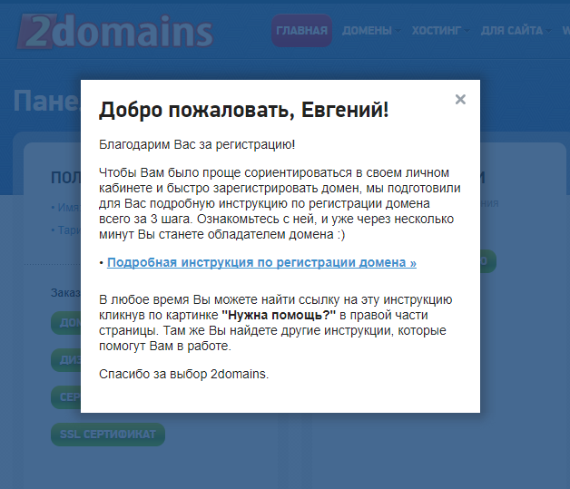
> 7. Если вы всё выполнили правильно, то теперь у вас есть свой домен. Отлично!

* Как зарегестрировать хостинг?

> 1. Переходим на сайт https://timeweb.com/ru/
> 2. Нажимаем на ***[Хостинг]***

> 3. Выбираем тариф Optimo+ и нажимаем ***[Разместить сайт]***
> 4. Заполняем инфомацию о пользователе, соглащаемся с условиями оферты и нажимаем ***[Заказать]***
> 5. После этого нас перебросит в личный кабинет и вся необходимая информация придёт на электронную почту. А именно, пароль и логин от timeweb. На это обратите внимание.

* Как припарковать домен на хостинг? 

> Для начала необходимо ***Создать новый сайт***
> 1. Нажимаем ***[Сайт]*** в меню слева.
> 2. Нажимаем ***[Создать новый сайт]***
> 3. Указываем ***Имя дирректории***  и нажимаем ***Создать***
> Это мы сделали для того, чтобы создать папку для нашего домена, потому что хостинг не создает автоматически папки при парковке доменов.
> 4. Теперь нажимаем ***Домены и поддомены** в меню слева
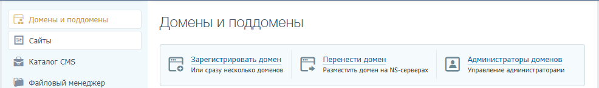
> Нажимаем ***Перенести домен***. Читаем инструкцию. Вообще, привыкаем читать.
> Нам потребуются только следующие 4-ре ns-сервера
> ns1.timeweb.ru
> ns2.timeweb.ru
> ns3.timeweb.org
> ns4.timeweb.org
> 5. Переходим на сайт, на котором регистрировали свои домен.
> 6. В меню сайта нажимаем ***Домены*** ***Мои Домены*** и нажимаем на свой домен.
> 7. В появившемся окне нажимаем ***Управление ДНС-серверами/Делегирование***
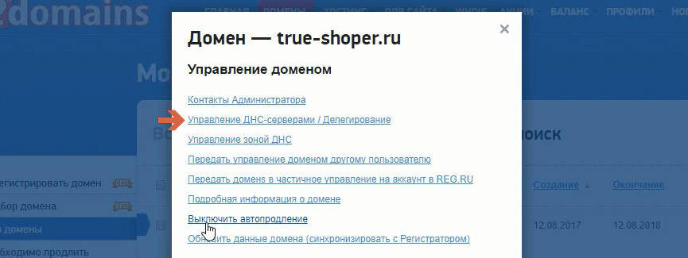
> 8. Убираем галочку *** Использовать сервера регистратора - БЕСПЛАТНО*** , прописываем свои ns - сервера следующим образом
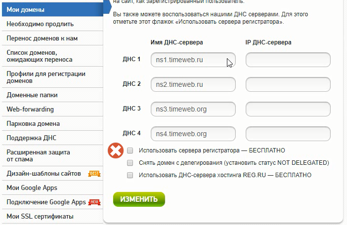
> 9. Нажимаем ***Изменить***
> 10. Готово. Теперь нужно будет подождать пока хостин обновит ДНС-сервена. Эта процедура может продлиться до 24 часов. После этого можно будет работать с нашим доменом и хостингом. Ждём и продолжаем работу. В дальнейшем, когда вы будете создавать и регистрировать домены, хостинги, и у вас будут возникать сложности, то пишите в поддержку, потому что они всегда отвечают. Консутльтанты TimeWeb делают это буквально сразу же. Даже мои друзья мне не отвечают так быстро! Пользуйтесь этой возможностью и не сдавайтесь.

# 3. Глава | Партнерские сети

Есть много партнерских сетей, но мы возьмем одну, чтобы в дальнейшем работать с нею. Начнем с товарки. И да, нет, это не m1-shop. В дальнейшем расскажу, какую взять товарку для инфобиза, гемблинга, адалта.

> 1. Регистрируемся в http://webmaster.ryumka.biz
> 2. Переходим по ссылке и регистрируемся. Процесс легкий и сложностей возникнуть не должно.
> 3. Попадаем в личный кабинет. Нужно ознакомиться с дизайном и функциями, которые предлагает нам ПП.
>
> Новости - информация о поступлении новых офферов, закрытии офферов, повышении выплат, понижении выплат, изменение условий и так далее. 

> 
> Cтатистику пропускаем, поскольку она не работает. Она и не нужна тут. В другой ПП у них отличная статистика, а для товарки нет необходимости, поскольку вы будете настраивать яндекс метрику и всю необходимую информацию узнаете оттуда.
>
> Заказы - информация о заказак(лидах), которые вы получаете, откручивая рекламу. 
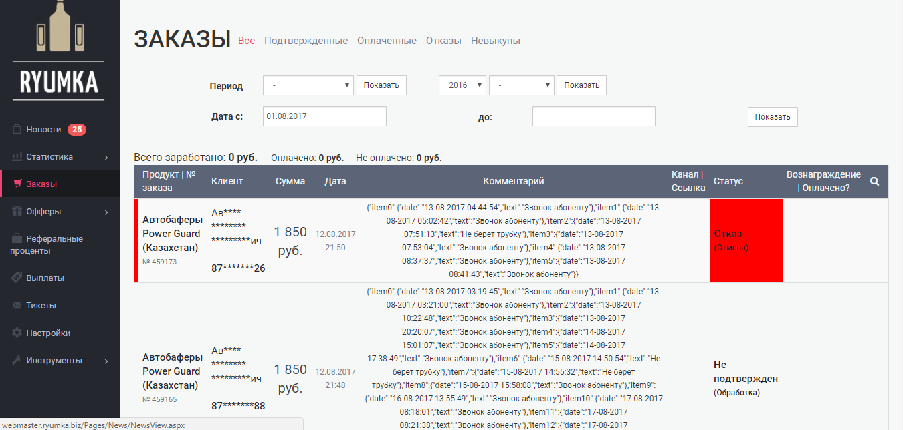  
>
>Офферы - база товаров, на которые можно сливать трафик.
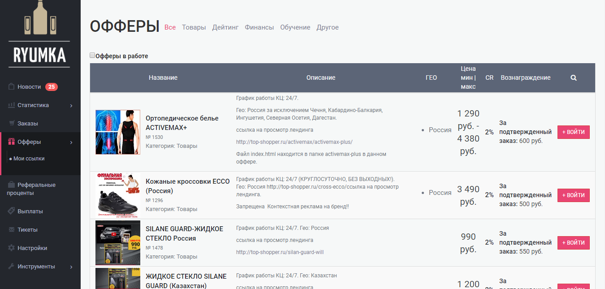
>
> Реферальные проценты пропускаем
>
> Выплаты - когда заработате, то можете заказать выплату. В данной партнерской сети выплаты делаются каждый четверг.
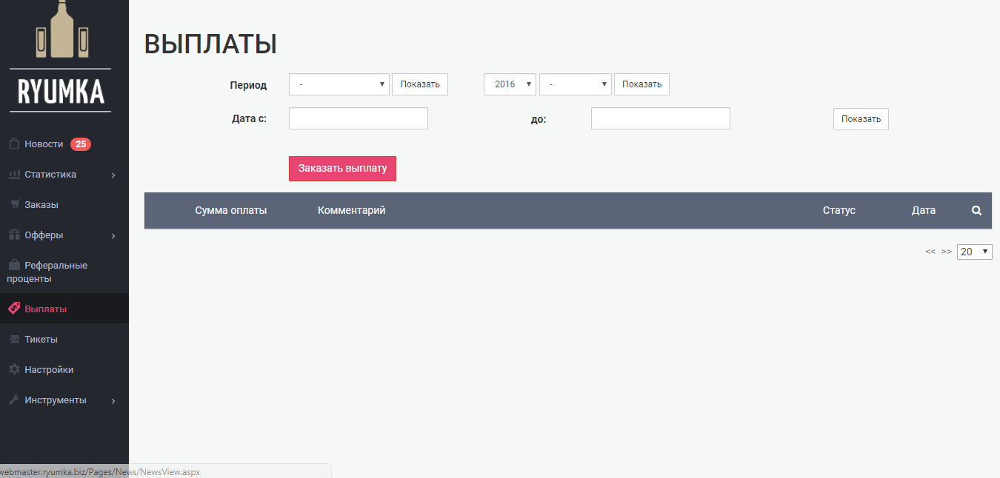
>
> Тикеты - если вам нужно открыть закрытый оффер, то вы создаёте тикет, нажимая кнопку ***Добавить*** и просите об этом.
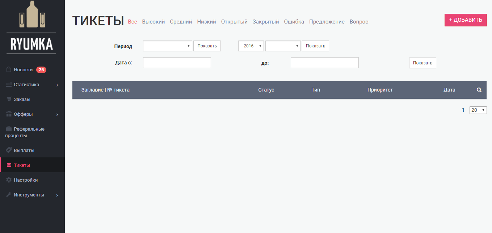
>
> Настройки и инструмены пропускаем.

**Важно**

* Добавьте суппорта в скайп ***support@ryumka.biz***
* Попросите личного менеджера
* Подружитесь с супортом и менеджером

Отлично! Теперь у вас есть домен, хостинг, вы зарегестрированы в партнёрской сети, вы добавили суппорта в скайп, попросили личного менеджера.
Если нет, то дальше не продолжайте, потому что теперь вы переходите к серьезной главе.

# 4. Глава | Финансы | Софт

Тут всё предельно понятно. Для работы с финансами вам потребуется:

1. Webmoney + регистрация + привязать паспортные данные. 
2. Карта (msstercard, к примеру) на ваше имя, конечно же.

> Не советую Yandex Money, поскольку у них огромные проценты, тогда как у webmoney либо вообще нет, либо маленькие.

# 5. Глава | GitHub | Sublim Text

* Github в роли хостинга и домена одновременно

>Важные моменты, поскольку в процессе будет устанавливаться IDE, через которую вдальнейшем будут редактироваться html коды (лендинги и много другое).

Действительно ли можно использовать Github в роли хостинга и домена + можно привязать свой домен!

* Да

Помимо этого Github можно использовать как хранилище всех ваших данных(файлы, изображение и так далее).
Для арбитражника это может быть полезно для того, чтобы загружать креативы с тестов и удобно указывать на них ссылку в гугл таблицах, что в свою очередь позволит вести правильную аналитику! Преимущество в том, что данные никуда не потеряются! К тому же, фалы легко можно скачивать архивом, что удобно, если вы захотите с кем-нибудь поделиться информацией.

> Если вы никому не сообщите о своём гитхабе, то никто и не узнает, что, где, как! В крайнем случае github позволяет делать папки приватными за дополнительную плату, чтобы никто кроме вас не имел доступ!

Как же это сделать так, что бы работать было удобно и комфортно? Легко и сейчас я расскажу и покажу, как же это сделать!  

*** С поправкой на ветер: данный способ подходит для статических сайтов(например, лендингов). Для более серьезных сайтов (форумов) придется использовать обычные хостинги(платить за них).***

1. **Шаг первый** - регистрация Github

Переходим на сайт https://github.com/

Вводим на английской раскладке Username , email , и password и нажимаем *** Sign up for GitHub ***

Ничего не изменяем и нажимаем ***Continue***
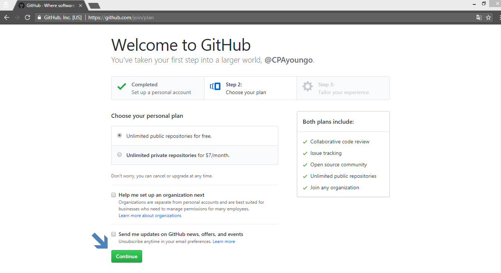   

Далее по вашему желанию вы можете указать для чего вам необходим GitHub, но я советую просто нажать ***Subit***
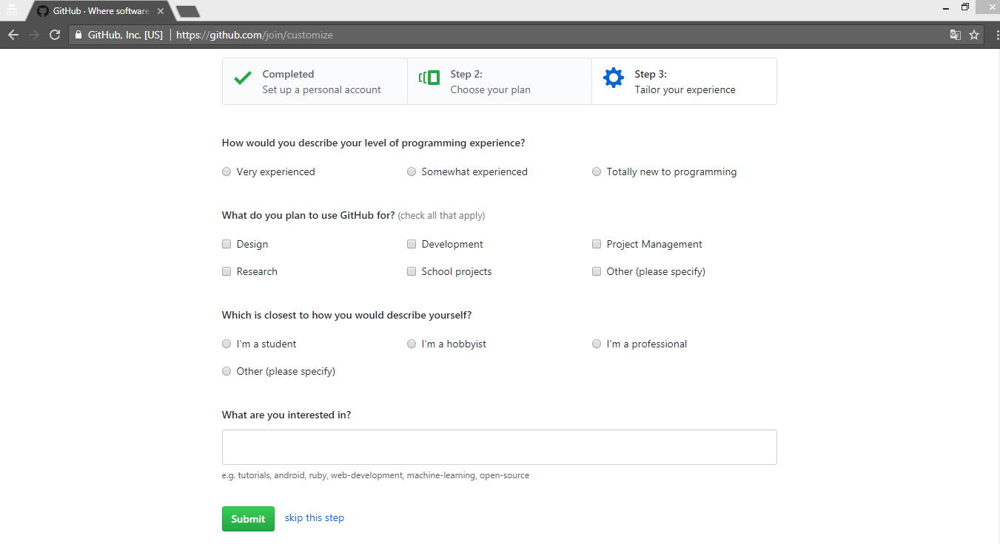

Отлично! Теперь переходим на свою электронную почту и подтверждаем регистрацию.

Возвращаемся обратно и в правом верхнем углу нажимаем на галочку, затем - ***Your profile***. 

2. **Шаг второй** - устанавливаем Github на компьютер

Переходим на сайт https://desktop.github.com/ и нажимаем ***Download ... *** 


Открываем файл, который скачали! Следуем инструкциям, которые предлагает GitHub. Там, где потребуется ввести Username и email, вводим данные, которые использовали при регестрации на GitHub.

Теперь всё готово к работе! Легко, не правда ли? А еще легче работать и подгружать данные с компьютера на сам GitHub.

3. **Шаг третий** - устанавливаем IDE. Зачем? поймете позднее!

Скачиваем Sublim Text. 
Переходим на сайт https://www.sublimetext.com/ и скачиваем! После этого устанавливаем. Установка простая, поэтому показывать нет смысла.


4. **Шаг четвертый** - интеграция Sublim Text и GitHub Desktop

Открываем программу GitHub Desktop, которую установили. Приблизительно так она выглядит!


Итак, для начала создадим репозиторий - пака на вашем компьютере и в дальнейшем репозиторий на GutHub.

В этой программе нажимаем ***File*** затем ***New repository***. Либо нажимаем ctrl+N. Как вам будет удобнее.
Вводим Name, ставив галочку, как показано на скриншоте и нажимем ***Create repository***.
Ах, да, чуть было не забыл. Изменяем Local path на любую другую папку, в которую будут сохраняться репозитории, либо оставляем все так, как оно есть.

Нажимаем, куда указывает красная стрелка на скриншоте:
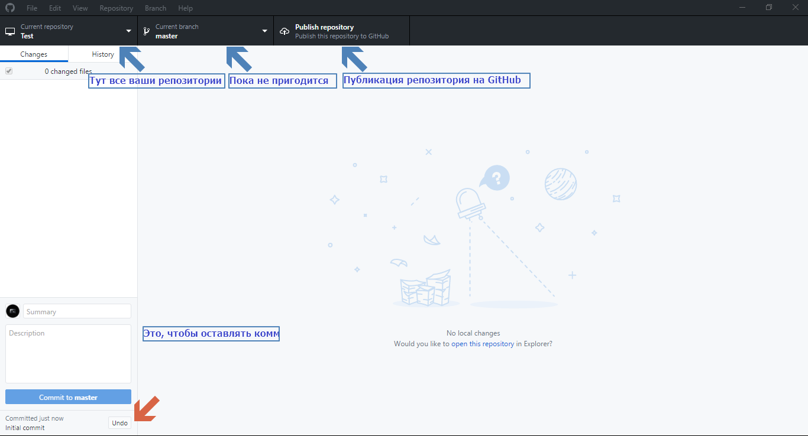

Теперь нажимаем правой кнопкой мыши на Файл README.md  и выбираем ***Open whith default program***. Соответственно для сторонней программы выбираем Sublim Text, который установили до этого! Интеграция завершена.

Теперь, чтобы открывать какие - либо репозитории в Sublom text вам нужно нажать ctrl+shift+A.


Работать в IDE также, как и в блокноте, только куда удобнее и проще! Функционал Sublim text постарайтесь изучить самостоятельно.

Также, для того, чтобы открыть папу репозитория легко и быстро достаточно нажать ctrl+shift+F.


Давайте теперь вновь откроем Sublim Text(ctrl+shift+A). Нажмем на файл README.md и что-нибудь напишем. После этого, чтобы сохранить нажмем ctrl+S. Тем самым, изменённая информация сохранится! Перейдём обратно в программу GitHub Desktop и в левом нижнем углу напишем комментарий к изменению, нажав после этого ***Commit to master***, либо ctrl+Enter. Затем ctrl+P, чтобы опубликовать изменения на GitHub. Убираем галочку ***Keep this code private***
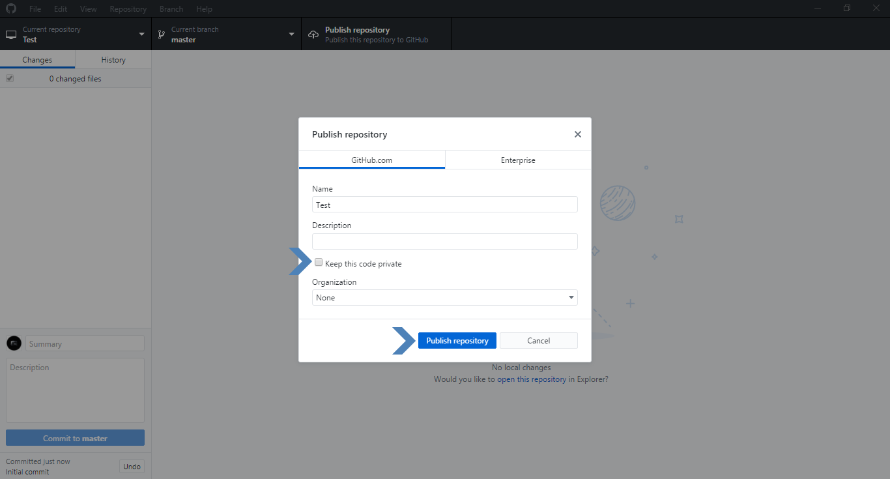

Переходим в браузер в свой профиль GitHub и видим, что у нас появился репозиторий, который мы создали!

Теперь вы сможете быстро подгружать всю необходимую информацию на сервис. Постоянно этого делать не нужно. По крайней мере, теперь ваши файлы будут храниться в одной большой папке и не будут разбросаны где попало + железно храниться на GitHub, доступ к которому вы можете получить с любого компьютера, имеющего интернет. С GitHub данные репозитория скачиваются архивом нажатием одной кнопки ***Clone or download***

5. **Шаг пятый** - GitHub в роли хостинга и домена

Для этого нам нужно создать новый репозиторий! Переходим в программу GitHub DesKtop и нажимаем ctrl + N.
Вводим Name: Username.github.io, ставив галочку для фала README.md и нажимаем ***Create repository***.
Открываем Sublim Text (ctrl+shift+A), редактируем файл README.md. Для этого нажимаем на файл и прописываем.

>	# Username.github.io
>
>	http://Username.github.io - ссылка, по которой доступна страница 

Сохраняем(ctrl+S).

Нажимаем тут же в Sublim Text (ctrl+N).
Пишем, например, так:

```html
	<!DOCTYPE html>
	<html>
	<head>
		<title></title>
	</head>
	<body>
	<p>Отличная работа, Друг!</p>
	</body>
	</html>
```

И сохраняем(ctrl+S) c именем index.html в репозиторий(папку) Username.github.io

Переходим обратно в программу GitHub Desktop, прописывем комметраний к изменениям, нажимаем crtl+Enter и потом ctrl+P. Теперь наши изменения опубликованы на GitHub.

Осталось только перейти по ссылке http://Username.github.io , чтобы посмотреть результат!


Иногда немного нужно подождать, чтобы сервер обновил информацию! (1-3 минуты)

Таким образом вы можете держать не один и не два сайта! Это тоже сдеать довольно-таки просто.

6. **Шаг шестой** - несколько сайтов.

Если вы хотите несколько сайтов, то вам просто нужно создать в репозитории Username.github.io папки для этих сайтов. Для этого просто переходите на компьютере в папку Username.github.io и создаете сколько хотите. Важно только то, что в кажжом из них должен быть файл index.html и README.md.

К примеру, если мы создадим в папке Username.github.io папку blog, то в ней обязательно должны присутствовать index.html и README.md. Причём, теперь уже файл README.md будет иметь такое вот содержание

>	# Username.github.io/blog
>
>	http://Username.github.io/blog - ссылка, по которой доступна страница 

После всех изменений делаем публикацию на GitHub аналогично тому, как уже делали! 

7. **Шаг седьмой** - можно Схитрить.

О чём я? К примеру, у нас есть сторонний сайт http://google.com/ а мы хотим где-либо использовать http://Username.github.io. 

Тогда просто достаточно сделать редирект!

Делается это следующим образом! 

Мы в папке Username.github.io в файле index.html прописываем следующий код

```html
<!DOCTYPE html>
<html>
<head>
	<title></title>
</head>
<body>

<script language="JavaScript"> 
  window.location.href = "http://google.com/"
</script>

</body>
</html>
```

То есть, мы с вами между тегами ***body*** вставили скрипт, который выполняет редирект(перенаправление) без соглашения на то пользователя!

Вот именно этот скрипт! Ссылку можно поменять.
```html
<script language="JavaScript"> 
  window.location.href = "http://google.com/"
</script>
```
8. **Шаг восьмой** - своё доменное имя и хостинг GitHub.

Гитхаб позволяет использовать собственное доменное имя вместо стандартного username.github.io. Для этого, разумеется, вам сначала нужно приобрести его.

На сайте GutHub перейдём в репозиторий Username.github.io.
Нажмём ***Settings***.
Двигаемся вниз до **GitHub Pages**.
***Custom domain** - прописываем доменное имя и нажимаем ***Save***

Теперь Гитхаб знает о нашем домене, однако, этого недостаточно — нужно изменить информацию о DNS-записях самого домена, для этого нам необходимо перейти на сайт доменного регистратора, где домен был куплен. Интерфейс работы с DNS-записями разный у каждого регистратора, но суть примерно одинакова.

Нам нужно настроить A-запись домена, для этого перейдём в панель управления DNS-записями, найдём (или добавим) A-запись и укажем «192.30.252.153» в качестве её значения.

Всё готово! В течение нескольких часов вы сможете открыть свой сайт, используя ваш домен.

> [Памятка](https://help.github.com/articles/setting-up-an-apex-domain/#configuring-a-records-with-your-dns-provider) GitHub по настройке А-записей у DNS провайдера.

8. **Шаг девятый** - правила оформления файла README.md на GITHUB
```html
# Заголовок

### h3 заголовок третьего уровня
#### h4 заголовок четвёртого уровня
##### h5 заголовок пятого уровня
###### h6 заголовок шестого уровня

[Мой сайт](http://webdesign.ru.net) - оформление ссылки словом 

**Жирный шрифт**
***Наклонный жирный***

`выделенные слова`

Вставка html кода.  Теги выделяются цветом по правилам html.
```html
<meta name="viewport" content="width=device-width, initial-scale=1.0">
``` 
Вставка php кода.  Теги выделяются цветом по правилам php.
```php
<?php here_pagecontent(); ?>
```
Выделенный цветом фона блок с каскадными таблицами. Теги выделяются цветом по правилам css.
```scss /* или css */
@import "bower_components/tree-normalize/generic.normalize";
h1 {
 font-size:1.5em;
 font-weight: 300;
}
```
Блок текста, выделенный тёмной полосой по левому краю (цитата).
> Текст
> 
> Продолжение текста выделенного блока
> Завершение текста

Нумерованный список.
* Пункт 1
* Пункт 2
* Пункт 3

1. Пункт 1
2. Пункт 2
3. Пункт 3

Вставка изображения в текст.


Так можно рисовать таблицы

Название файла  | Содержание файла
----------------|----------------------
style.css       | Пустой файл каскадной таблицы стилей, в который производится сбока необходимых стилей
reset.css       | Reset CSS от Эрика Мейера
normalize.css   | Нормалайзер CSS от Nicolas Gallagher
block.css       | Основные стили блоков системы
addition.css    | Дополнительные стили
fontawesome.css | Стили иконочного шрифта
layout.css      | Основные стили, применительно к определённому сайту
lightbox.css    | Стили лайтбокса, если таковой используется
index.html      | Индексный файл для проверки вносимых изменений

```
Всё это будет выглядеть красиво в файле README.md и в любом другом файле (.md), который вы опубликуете в GitHub.


Напоминаю, что GitHub вы будете использовать для того, чтобы хранить базу своих креативов и легко указывать на них ссылку в google таблице(поздее дам вам её), чтобы вести грамматную статистику и делать продуктивную аналитику.

# 4. Глава | Оффер

Оффер - это товар, который мы будем рекламировать. Но ведь товаров много. Да, это так, но нам надо брать те, целевую аудиторию, которых мы понимаем. 

* Как подобрать ЦА под оффер?

> ***Вы должны выполнить следующее задание***
>
> У нас есть оффер. Это бинокль http://top-shopper.ru/canon-binokl/
> Вопрос 1: Причины, по которым люди будут покупать этот бинокль?
> Вопрос 2: Для чего и в каких ситуациях и в каких ситуациях будут использовать этот бинокль?
> Вопрос 3: Какой пол будет чаще заказывать этот товар. Почему?
> Вопрос 4: Какой возраст клиентов этого товара. Почему?
> Вопрос 5: С каких населенных пунктов будет больше заказов (миллионники или маленькие города) или может быть одинаково. Почему?
> Вопрос 6: В какое время по большей части должны поступать заказы. Почему?
> Вопрос 7: Какими рекламными заголовками в facebook можно зацепить пользователя? Напишите 3-5 примеров.
>
> ***Как можно больше времени и внимания уделите анализу товара. Если вы не понимаете ЦА данного оффера, то возьмите другой. В этом случае вы потратите меньше денег на рекламу. Да, потратите больше времени, но зато найдете хорошую гипотезу, которая, возможно будет успешной или почти успешной. Не торопитесь***
>
> Узнайте больше информации о товаре. Изучите форумы, сайты, сам сайт http://top-shopper.ru/canon-binokl/, обратите на что делает акцент рекламодатель, какие преимущества имеет бинокль. Задайте себе вопрос: "Почему этот товар должны покупать?". Если вы найдете весомую причину, то уже можете расчитывать на прибыльную связку. Чем больше времени уделите анализу, тем лучше и уникальнее ваша гипотеза.
>
> Для своих рассуждений используйте https://publer.pro/ - мониторинг рекламных постов в рунете.
>
> Чем внимательнее и требовательнее вы будете, тем луше будет ваша гипотеза.
> 
> Вам пока не нужно думать, какой заголовок написать или же какой текст написать. Не нужно думать, как нарисовать креатив. Вам нужно понять, ***какую проблему решает товар?***. Именно это является важным моментом в понимании целевой аудитории. Если вы не нашли проблему, то дальше двигаться нельзя. Распишите хоть целый блокнот, но найдите эту золотую проблему.

* Как рисовать креативы?

> Нашли проблему? Изобразите на баннере. Используем минимум текста. Отражаем все подарки, если они есть. Креатив должен быть сочным, но не режущим глаза.
>
> Рисуем минимум 5 креативов 
> К примеру, на первом отражаем товар + текст + кнопка заказать.
> На втором - товар + текст + подарки, если есть + фон.
> На третьем - товар + текст + скидка + подарки, если есть + другой фон.
> На четвёртом - товар + текст + скидка + подарки + другой фон + кнопка заказать.
> На пятом - товар + скидка + подарки + другой фон + кнопка заказать.
> 
> Минимум текста!!! 
>
> ***Важно создавать креативы, релевантные сайту, заголовку и тексту, чтобы не получать отказы от перехода на сайт. 
>
> ***Совет***
> Используйте красный цвет, желтоватый, ораньжевый. Остальное уже тесты покажут. По возможности, не оставляйте белый фон.

***

# Техническая вставка - Wget

Для чего арбитражники используют Wget? Для того, чтобы скачать практически любой лединг!
Вам нужно установить wget на свой компьютер. В этом вам поможет [видео](https://www.youtube.com/watch?time_continue=1&v=qe8yUPwHJEU).

После установки вы можете открыть командную строку от имени администратора, написать 
wget -r -k -l 10 -p -E -nc http://имя-сайта.ру 
и нажать на enter. После перейти в папку со скачанным сайтом и использовать его в своих целях. 

К примеру, вам это может пригодиться для того, что бы разом спарсить все картинки с сайта для создания креативов.

Также вы можете в дальнейшем использовать этот сайт как свой, чуть-чуть изменив его. 

***

> Теперь вашей задачей является нарисовать 10 креативов для http://top-shopper.ru/canon-binokl/

* Как придумать заголовок и текст?

> В заголовке вы можете отобразить вид товара или же его преимущества, проблему.
> В текстве вы можете указать акцию, сколько осталось товара, какую проблему он решает. 
> Теперь вашей задачей является придумать 10 различных вариантов заголовка и текста для http://top-shopper.ru/canon-binokl/
> ***Важно*** Не нужно много текста, если это не оправдано, поскольку люди не любят читать. 90 символов достаточно, чтобы зацепить покупателя. Если сможете меньше - Поздарвляю! Но не престарайтесь с краткостью.

* Как выбрать источник под оффер?

> У нас есть оффер бинокль + часы в подарок.
> Ссылка на лендинг http://top-shopper.ru/canon-binokl/
>
> В каком источнике трафика Вы бы в первую очередь давали бы рекламу.
>
> Какие возможности данного источника использовали бы в первую очередь.
>
> Конечно - это вопрос на засыпку, потому как мы с Вами еще не приступили к изучению самих рекламных 
> источников.
>
> Ваша основная задача здесь понять кто Ваш идеальный клиент и в каком источнике, по Вашему мнению.
>
> 1. Больше всего нужного трафика.
>
> 2. Проще всего к нему будет достучаться.

* Как выбрать оффер под источник?

> Предположим, что мы работаем с источником Facebook.
> 
> Как Вы знаете - 50% этого источника, это трафик с одноклассников.
> 
> Какой оффер из актуальных в сегодняшнее время Вы бы рекламировали в Facebook. Почему?
>
> Запишите все свои рассуждения.

# Математика

Это задание предельно простое, но если Вы не понимаете самой сути KPI и конверсий, Вам может быть непросто его выполнить. 

- Мы рекламируемся в тизерной сети по CPM (показы)

- Мы зарабатываем 500 рублей с одного лида

- Предположим, что наш баннер увидело 1000 человек

- Конверсия баннера 2% (количество людей, перешедших на сайт)

- Конверсия лендинга 5% (количество людей из перешедших, которые сделали заказ)

1. сколько максимум должен стоить клик при условии выхода в 0 ?

2. сколько максимум может стоить 1000 показов при условии выхода в 0 ?

Полученные данные могут отличаться от того, что Вам предстоит увидеть в реальной практике :)

* 7 случаев из практики

Итак.

Предлагаю Вашему вниманию 10 случаев из реальной практики.

Что бы Вы сделали?

Случай №1: Создали рекламу в таргет ВК. В РК 10 тизеров. Открутили на каждой по 100 рублей. Получили одного валидного лида, но все равно вышли в минус.

И Вы знаете, что этот лид пришел с определенного тизера (он был протрекирован). Что бы Вы делали дальше?

Случай №2: Вы успешно вели рекламу в рамках одного оффера и РСЯ. Но появилась куча конкурентов, лид стал дорогим и мероприятие стало нерентабельным.

Тем не менее, Вы идеально знаете целевую аудиторию, баннера, тексты, которые конвертируют этот оффер. Что бы Вы делали дальше?

Случай №3: Вы с нуля создали рекламную кампанию в Facebook. Она начала работать и в первые три дня принесла Вам ROI 60%. При том, что Вы просто раз её запустили и больше с ней не работали. Что бы Вы делали дальше?

Случай №4. Вы однажды создали рекламу в Директе. Месяц она у Вас крутилась в ROI 50%. А последние 2-3 дня крутиться в 0-10%. При этом, Вы не раз не изменяли эту рекламную кампанию. Как бы Вы поступили в таком случае?

Случай №5. У Вас есть три рекламных кампании. Они все дают ROI 50%. Но у Вас всего 30 000 рублей. Больше денег нет. Как бы Вы поступили в этом случае со своими деньгами и куда бы их вложили.

Случай №6. Вы проапрувили сомнительный оффер в ВК Таргете. Нашли очень целевую аудиторию с одного небольшого паблика (больше в ВК таких пабликов нет) и начали лить траф. В итоге за 2 дня Вы получили несколько десятков лидов по 50 рублей (а за лид платили 500 рублей). Но Вашу рекламу забанили, т.к она нарушает правила ВК.

Новые попытки модерации безуспешны, напрямую Ваш лендинг не модерируют. Что бы Вы сделали дальше в этом случае?

Случай №7. У Вас есть связка с которой Вы работали по ГЕО РФ долго и счастливо с большим ROI. И этот же оффер появился в Казахстане буквально вчера. Что бы Вы сделали?

# Выбор оффера

* Ниши в CPA - бизнесе

1. Дейтинг (знакомства, социальные проекты).
2. Финансы (кредиты, депозиты).
3. Инфобизовые офферы (треннинги, курсы, вебинары).
4. Физические товары(одностраничники)
5. Интернет - магазины.
6. Азарнтные услуги(казино, покер, ставки).
7. Адалт.
8. Игровая тематика.
9. Мобильные приложения.

* Обращаем внимание на:

1. Физические товары 
2. Мобильные 
3. Казино
4. Игровые офферы

* Cубъективные критерии выбора оффера

1. Конкуренция (Директ, вордстат, паблер)
2. Понимание оффера и ЦА
3. Время оффера на рынке
4. Колличество размещений данного оффера в разных СPA сетях
5. Сезонность и актуальность оффера

* Что такое эксклюзивный оффер:

1. Новый
2. Минимум конкуренции
3. Открыт только для вас(или ограниченной группе вебмастеров)
4. Завышенные выплаты именно для Вас

Фишки в самом оффере, на которые следует обратить внимание: 

1. Комбинированные офферы (наборы / что-то в подарок)
2. Качественные лендинги
3. Сезонная актуальность
4. Репутация оффера
5. Информация об оффере.


